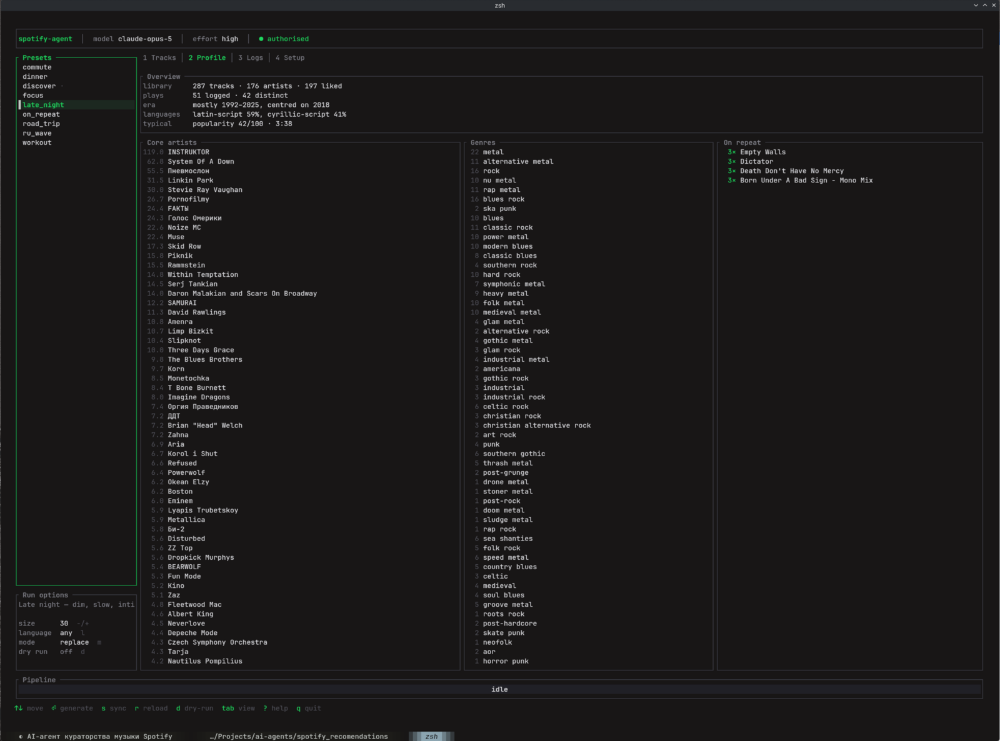
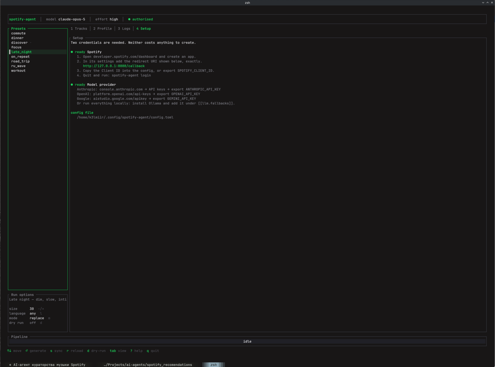
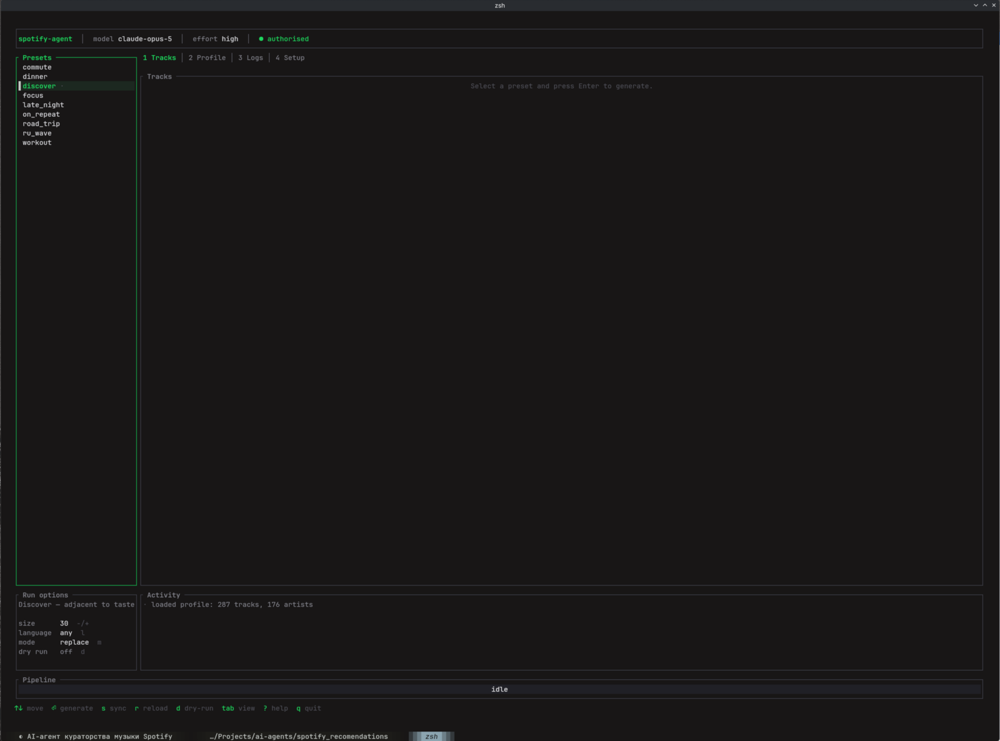
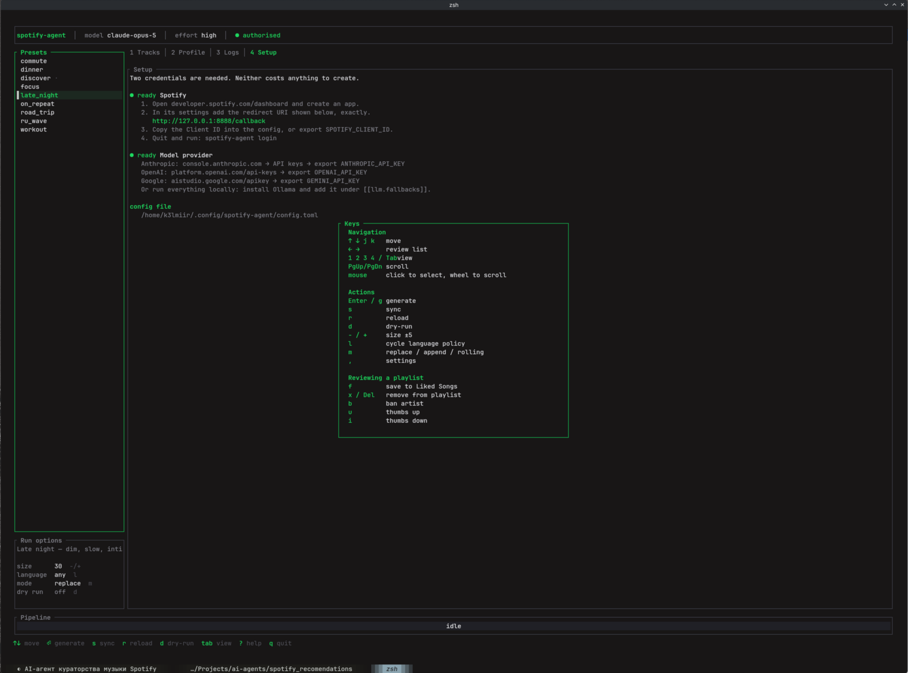
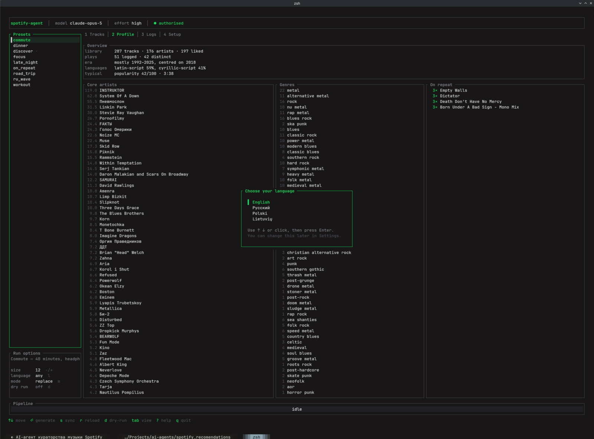

# spotify-agent

Builds Spotify playlists by analysing your listening history locally and asking
an LLM to curate against it. Runs as a terminal UI or unattended from a timer.

It is not a "more like this" button. It keeps its own copy of your play history
— Spotify's API only ever returns your last 50 plays — works out what you
actually listen to, and asks a model to reach one step outward from that.
Then it watches what you do with the result and adjusts.

```
spotify-agent                    # interactive TUI
spotify-agent generate focus     # one playlist, right now
spotify-agent --cron generate    # what the timer runs
```



That profile is built entirely from local data, and it is what goes into the
prompt — not a genre label, but the artists you actually return to, the era you
sit in, the split between scripts, and what you have had on repeat this month.

## What it does

- **Learns from a real history.** Liked Songs, top tracks and artists across all
  three Spotify windows, and every play event it has ever seen, in local SQLite.
- **Never repeats itself.** Tracks it has placed are excluded permanently by
  default, and artists get a cooldown, so consecutive runs don't circle the same
  twenty bands.
- **Closes the loop.** Saving a recommendation counts as approval; deleting it
  from the playlist, or skipping it, counts against. Those weights feed the next
  prompt.
- **Falls over gracefully.** Anthropic, OpenAI, Gemini and Ollama can be chained;
  if the first can't answer, the next one is asked.
- **Doesn't lose your playlists.** Every destructive write is preceded by a local
  snapshot you can restore.

## Install

No root, no package manager, nothing outside your home directory.

**Linux / macOS**

```sh
curl -fsSL https://raw.githubusercontent.com/ilyakubryakov/k_spotify_recomendations/main/packaging/install.sh | sh
```

**Windows** — a normal PowerShell prompt, *not* an elevated one:

```powershell
irm https://raw.githubusercontent.com/ilyakubryakov/k_spotify_recomendations/main/packaging/install.ps1 | iex
```

Both download a prebuilt binary from
[Releases](https://github.com/ilyakubryakov/k_spotify_recomendations/releases) and verify it
against the release's `SHA256SUMS` before installing anything. Re-run to
upgrade. Passing options through the pipe:

```sh
curl -fsSL .../install.sh | sh -s -- --add-path --schedule daily
```
```powershell
& ([scriptblock]::Create((irm .../install.ps1))) -Schedule Daily
```

| | Binary | Config | Data |
|---|---|---|---|
| Linux | `~/.local/bin` | `~/.config/spotify-agent/` | `~/.local/share/spotify-agent/` |
| macOS | `~/.local/bin` | `~/Library/Application Support/spotify-agent/` | same |
| Windows | `%LOCALAPPDATA%\Programs\spotify-agent` | `%APPDATA%\spotify-agent\config\` | `%APPDATA%\spotify-agent\data\` |

`--uninstall` / `-Uninstall` reverses everything except your config and cache.

### Updating

The agent keeps itself current. Once a day it asks GitHub whether there is a
newer release; if there is, the TUI offers a dialog and every other command
prints one line on stderr. Nothing is downloaded until you say yes.

```sh
spotify-agent update            # check, show the notes, ask, install
spotify-agent update --check    # report only, download nothing
spotify-agent update --yes      # for scripts
spotify-agent update --to v0.1.1  # go back to a specific release
```

It replaces the binary where it already lives, so it needs no more privilege
than the install did. The archive is verified against the release's
`SHA256SUMS` and then run once with `--version` before anything is swapped —
a wrong-architecture or truncated download is refused while your working
binary is still in place.

Turn the automatic check off with `enabled = false` under `[update]`, per-run
with `--no-update-check`, or machine-wide with
`SPOTIFY_AGENT_NO_UPDATE_CHECK=1`. Unattended runs (`--cron`) never prompt and
never install unless you set `auto_install = true`.

If you installed through a package manager the updater says so and stops
rather than overwriting files it does not own.

### Building from source

Prebuilt binaries exist for x86-64 and arm64 Linux (glibc and musl), macOS as a
single universal binary covering Apple Silicon and Intel, and x86-64 Windows.
Anything else, build it yourself.

You need a **Rust toolchain** and a **C compiler** — SQLite is compiled in
rather than linked, which is why the finished binary has no runtime
dependencies at all.

```sh
# Linux — C compiler from your distro
sudo apt install build-essential     # Debian/Ubuntu
sudo pacman -S base-devel            # Arch
curl --proto '=https' --tlsv1.2 -sSf https://sh.rustup.rs | sh

git clone https://github.com/ilyakubryakov/k_spotify_recomendations && cd k_spotify_recomendations
sh packaging/install.sh --from-source --add-path
```

```sh
# macOS — the compiler comes from the Command Line Tools
xcode-select --install
curl --proto '=https' --tlsv1.2 -sSf https://sh.rustup.rs | sh

git clone https://github.com/ilyakubryakov/k_spotify_recomendations && cd k_spotify_recomendations
sh packaging/install.sh --from-source --add-path
```

```powershell
# Windows — MSVC build tools, then Rust. Neither needs to stay elevated after
# install; the agent itself never requires administrator.
winget install Microsoft.VisualStudio.2022.BuildTools `
  --override "--quiet --wait --add Microsoft.VisualStudio.Workload.VCTools --includeRecommended"
winget install Rustlang.Rustup

git clone https://github.com/ilyakubryakov/k_spotify_recomendations; cd k_spotify_recomendations
.\packaging\install.ps1 -FromSource
```

Or just `cargo build --release` and copy `target/release/spotify-agent`
wherever you like — the installer is a convenience, not a requirement.

## Setup

Two credentials, both free.

**Spotify.** Create an app at
[developer.spotify.com/dashboard](https://developer.spotify.com/dashboard), add
`http://127.0.0.1:8888/callback` as a redirect URI, and put the Client ID in the
config. There is no client secret: the agent uses PKCE, which is the correct
flow for a desktop binary.

**A model provider.** Any one of:

| Provider  | Key from                          | Environment variable |
|-----------|-----------------------------------|----------------------|
| Anthropic | console.anthropic.com             | `ANTHROPIC_API_KEY`  |
| OpenAI    | platform.openai.com/api-keys      | `OPENAI_API_KEY`     |
| Google    | aistudio.google.com/apikey        | `GEMINI_API_KEY`     |
| Ollama    | — runs locally, no key            | —                    |

Then:

```bash
spotify-agent config init      # writes a commented config.toml
export ANTHROPIC_API_KEY=...
spotify-agent login            # opens a browser, stores tokens at mode 0600
spotify-agent                  # TUI
```

The TUI's **Setup** tab shows the same instructions with your own paths filled
in, and marks what is still missing.



## The interface

The TUI is the main way to drive it: pick a preset on the left, press Enter,
watch the pipeline run, then review what came back. Mouse works too — click a
preset or a track, scroll with the wheel.



`?` lists every key. The bottom group is the review pass: with a generated list
on screen, `f` saves a track to Liked Songs, `x` drops it from the playlist, `b`
bans the artist for good. Each one is a signal the next run reads.



## Presets

A preset is mostly a *brief* — a paragraph handed to the model describing the
listening situation. That paragraph does far more work than any genre list, so
it is worth writing your own.

Built in: `discover`, `road_trip`, `focus`, `workout`, `late_night`, `ru_wave`,
`on_repeat`. Add to them in `config.toml`:

```toml
[presets.commute]
label = "Commute — 40 minutes, headphones, morning"
brief = """
Build a set for a 40-minute morning commute on headphones, in a city, on foot
and underground. It has to survive background noise without being shouty:
mid-tempo, clear production, strong low end. Start gently and reach full energy
by the third or fourth track.
"""
size = 12
max_per_artist = 1
```

Presets inherit everything from `[defaults]` and override only what they name.
Blocklists are additive — a preset can narrow, never un-block.

## Filling strategies

| Strategy  | Behaviour                                                        |
|-----------|------------------------------------------------------------------|
| `replace` | Rebuilds the playlist each run. Anything unheard is lost.        |
| `append`  | Adds and de-duplicates. Grows without bound.                     |
| `rolling` | Holds exactly `size` tracks: adds new picks, evicts the least engaging. |

`rolling` is the one to use for a playlist you live with. It protects recent
additions with a grace period and caps evictions per run, so material you
haven't reached yet doesn't get washed away.

## The feedback loop

Four signals, all derived from things Spotify actually exposes:

| Signal    | Evidence                                                         |
|-----------|------------------------------------------------------------------|
| liked     | the track is now in Liked Songs and wasn't when it was picked     |
| played    | it appears in the play history and ran long enough                |
| skipped   | the *next* play started before this one could have finished       |
| removed   | it was in a managed playlist and isn't any more                   |

Skips are **inferred** — the Web API has no skip event. The inference is good
but over-reports (a long pause looks like a skip), so an inferred skip is
weighted lower than an explicit thumbs-down, and every signal decays with a
configurable half-life.

The review keys above feed the same store, weighted higher than the inferred
signals because you meant them. `spotify-agent feedback` shows what it has
concluded so far.

## Background runs

```bash
spotify-agent schedule install --every daily --at 07:30 --preset discover
spotify-agent schedule status
spotify-agent schedule remove
```

Writes a `systemd --user` timer, a launchd LaunchAgent, or a current-user
Scheduled Task depending on the platform. None of them needs elevation — which
is exactly what causes the caveats below, since running while you are logged out
is the thing that costs privileges:

- **systemd** user timers stop when your last session ends. For a headless box:
  `sudo loginctl enable-linger $USER` (the one command here that wants root).
- **Windows** tasks are registered "Interactive only" — they run while you are
  logged in and not otherwise. A task that runs logged-out has to store your
  password, which is not a trade this installer makes for you.
- **launchd and Task Scheduler** don't inherit your shell environment, so
  `ANTHROPIC_API_KEY` must be set where they can see it — `launchctl setenv`, a
  user-scoped environment variable, or the config file at mode 0600.

Exit codes follow `sysexits.h`, so a wrapper can tell "retry later" from
"your config is wrong":

| Code | Meaning                          |
|------|----------------------------------|
| 0    | success                          |
| 69   | upstream unavailable / refusal   |
| 75   | temporary — rate limited, retry  |
| 77   | not authorised — run `login`     |
| 78   | configuration error              |
| 130  | interrupted                      |

## Exporting

```bash
spotify-agent export --playlist "AI · focus" --format m3u8
spotify-agent export --snapshot 12 --format csv -o backup.csv
spotify-agent snapshots list
spotify-agent snapshots restore 12 --yes
```

M3U8 entries carry full `#EXTINF` metadata and point at track URLs, so the file
stays useful outside Spotify. Snapshots are taken automatically before every
overwrite.

## Interface languages

English, Russian, Polish and Lithuanian. The TUI asks on first run and
remembers; change it later with `,` in the TUI or `spotify-agent config
language ru`. Only the interface is translated — logs and `--json` output stay
in English so tooling and bug reports remain greppable.



Polish and Lithuanian were not written by native speakers. Corrections welcome.

## Configuration

`~/.config/spotify-agent/config.toml` on Linux, `~/Library/Application
Support/spotify-agent/` on macOS, `%APPDATA%\spotify-agent\config\` on Windows.
`config.example.toml` in this repo is the annotated reference.

Precedence, last wins: built-in defaults → config file → environment → CLI flags.
Environment overrides use `SPOTIFY_AGENT__SECTION__FIELD`:

```bash
SPOTIFY_AGENT__CLAUDE__MODEL=claude-opus-5 spotify-agent generate
SPOTIFY_AGENT__DEFAULTS__SIZE=50 spotify-agent --cron generate
```

Secrets are never written back: `config show` redacts them, and the token store
is created at mode 0600. The agent warns if your config is group-readable.

## Commands

```
login / logout / status      authorisation and a health check
sync                         pull library, top items, plays
profile                      the computed taste profile
generate                     make a playlist
recommended / forget         inspect and reset the anti-repeat memory
feedback / ban / unban       what it learned, and overriding it
snapshots / export          backups and portable tracklists
schedule                     background runs
update                       check for and install a new release
cache / config / history     housekeeping
```

`--help` on any of them. `completions <shell>` prints a completion script.

## Development

```bash
cargo test           # 200-odd tests, no network required
cargo clippy --all-targets
```

The HTTP layers are tested against a scripted mock server in `tests/`, which
pins each provider's exact request shape — the failure mode when one drifts is
otherwise a 400 at 3am in a cron run. `tests/packaging.rs` checks the installer
scripts, which nothing else type-checks, and `tests/update_wire.rs` drives the
self-updater through a real archive — including the checksum mismatch and the
missing asset, since those are the paths that decide whether a bad download can
land on a user's machine. `docs/architecture.md` covers the
layering and the decisions that aren't obvious from the code.

CI runs fmt, clippy, the suite on all three platforms, an MSRV check, installer
linting (shellcheck + PSScriptAnalyzer) and `cargo audit`. Tagging `v*` builds
binaries for six targets and publishes them with checksums.

## Licence

MIT.
